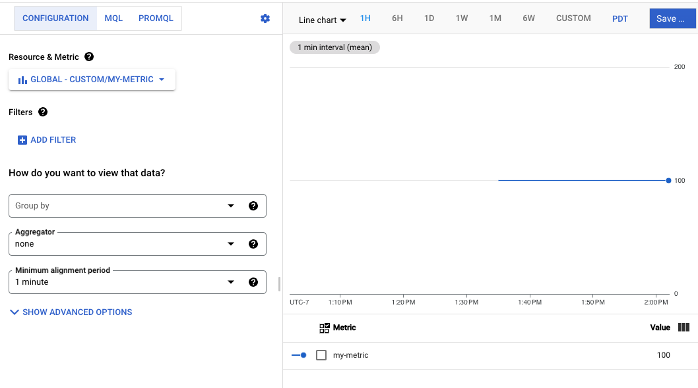

# Custom Metrics Autoscaler for GKE
This demo ilustrates how to deploy a Custom Metrics Autoscaler on GKE, using external metrics. 


## Deployment Overview
Below is a high-level diagram of this demo and each of its main components. Leveraging the [Horizontal Pod Autoscaler](https://kubernetes.io/docs/tasks/run-application/horizontal-pod-autoscale/), we are able to scale our workloads based on external metrics which, in this demo, are stored on a CloudSQL MySQL database. 


## CloudSQL Setup
1. Create a CloudSQL MySQL instance
2. Create a database named `custom-metrics-db`
3. Create a metrics table and populate it with some data
```
USE custom-metrics-db;

CREATE TABLE metrics (
    metric_name varchar(255),
    metric_value int
);

INSERT INTO metrics (metric_name,metric_value) VALUES ("app-metric-1",100);
```

## GKE Setup
### Workload Identity setup overview
We need to provide credentials for both the Metric Writer app as well as the Stackdriver Adapter app. To avoid using a credential file, we will leverage Workload Identity. The setup will be as follows:
1. Metric Writer app:
KSA <-> GSA -> IAM permissions: `roles/cloudsql.client` and `roles/monitoring.metricWriter`

2. Stackdriver Adapter app: 
KSA <-> GSA -> IAM permissions: `roles/monitoring.viewer`

### Instructions
1. Create a GKE cluster with Workload Identity enabled

2. Create a namespace for both apps
```
kubectl create ns metrics-writer
kubectl create ns custom-metrics
```

3. Create KSAs for both apps
```
kubectl create serviceaccount ksa-metrics-writer -n metrics-writer
kubectl create serviceaccount custom-metrics-stackdriver-adapter -n custom-metrics
```

4. Create GSAs for both apps
```
gcloud iam service-accounts create gsa-metrics-writer
gcloud iam service-accounts create gsa-custom-metrics-adapter
```

5. Bind the KSA and GSA for the Metric Writer app
```
gcloud iam service-accounts add-iam-policy-binding \
    --role roles/iam.workloadIdentityUser \
    --member "serviceAccount:<PROJECT_ID>.svc.id.goog[metrics-writer/ksa-metrics-writer]" \
    gsa-metrics-writer@<PROJECT_ID>.iam.gserviceaccount.com
```

6. Bind the KSA and GSA for the Stackdriver Adapter app
```
gcloud iam service-accounts add-iam-policy-binding \
    --role roles/iam.workloadIdentityUser \
    --member "serviceAccount:<PROJECT_ID>.svc.id.goog[custom-metrics/custom-metrics-stackdriver-adapter]" \
    gsa-custom-metrics-adapter@<PROJECT_ID>.iam.gserviceaccount.com
```

7. Bind the GSA for the Metric Writer app to the IAM permissions
```
gcloud projects add-iam-policy-binding <PROJECT_ID> \
    --member serviceAccount:gsa-metrics-writer@<PROJECT_ID>.iam.gserviceaccount.com \
    --role roles/cloudsql.client

gcloud projects add-iam-policy-binding <PROJECT_ID> \
    --member serviceAccount:gsa-metrics-writer@<PROJECT_ID>.iam.gserviceaccount.com \
    --role roles/monitoring.metricWriter
``` 

8. Bind the GSA for the Stackdriver Adapter app to the IAM permissions
```
gcloud projects add-iam-policy-binding <PROJECT_ID> \
    --member serviceAccount:gsa-custom-metrics-adapter@<PROJECT_ID>.iam.gserviceaccount.com \
    --role roles/monitoring.viewer
```

9. Anotate the KSAs with the GSAs
```
kubectl annotate serviceaccount -n metrics-writer ksa-metrics-writer \
iam.gke.io/gcp-service-account=gsa-metrics-writer@<PROJECT_ID>.iam.gserviceaccount.com

kubectl annotate serviceaccount -n custom-metrics custom-metrics-stackdriver-adapter \
iam.gke.io/gcp-service-account=gsa-custom-metrics-adapter@<PROJECT_ID>.iam.gserviceaccount.com
```

10. Create a secret for CloudSQL proxy
```
kubectl create secret generic custom-metrics-secrets \
  -n metrics-writer \
  --from-literal=db_user="root" \
  --from-literal=db_password=<YOUR-DATABASE-PASSWORD> \
  --from-literal=db_name="custom-metrics-db"
```

11. On Artifact Registry, create a US multi-region Docker repo named "metric-writer"

12. Build the Dockerfile and push the image to the Registry
```
cd metrics-writer/
docker build -t metric-writer-app .
docker images
docker tag <IMAGE_ID> us-docker.pkg.dev/<PROJECT_ID>/metric-writer/latest
docker push us-docker.pkg.dev/<PROJECT_ID>/metric-writer/latest
```

13. On file `k8s-resources/custom-metrics-writer.yaml`, replace the following:
* `<GCP_PROJECT_ID>` with your GCP project ID
* `<CLODSQL_CONNECTION_NAME>` with your CloudSQL connection name

14. Deploy the Metric Writer app
```
kubectl apply -f custom-metrics-writer.yaml
```

15. Deploy the Stackdriver Adapter app
```
kubectl create clusterrolebinding cluster-admin-binding \
    --clusterrole cluster-admin --user "$(gcloud config get-value account)"

kubectl apply -f https://raw.githubusercontent.com/GoogleCloudPlatform/k8s-stackdriver/master/custom-metrics-stackdriver-adapter/deploy/production/adapter_new_resource_model.yaml
```

16. Deploy the hello-server sample app
```
kubectl apply -f hello-server.yaml
```

17. Deploy the HPA
```
kubectl apply -f hpa.yaml
```

18. Check the HPA status
```
kubectl describe hpa hello-server -n metrics-writer
```
If everything went well, you should see something similar to this:
<pre>
Name:                                                        hello-server-hpa
Namespace:                                                   metrics-writer
Labels:                                                      <none>
Annotations:                                                 <none>
CreationTimestamp:                                           Mon, 13 Mar 2023 20:43:56 +0000
Reference:                                                   Deployment/hello-server
Metrics:                                                     ( current / target )
  "custom.googleapis.com|my-metric" (target average value):  20 / 20
Min replicas:                                                1
Max replicas:                                                30
Deployment pods:                                             5 current / 5 desired
Conditions:
  Type            Status  Reason              Message
  ----            ------  ------              -------
  AbleToScale     True    ReadyForNewScale    recommended size matches current size
  ScalingActive   True    ValidMetricFound    the HPA was able to successfully calculate a replica count from external metric custom.googleapis.com|my-metric(nil)
  ScalingLimited  False   DesiredWithinRange  the desired count is within the acceptable range
Events:
  Type    Reason             Age    From                       Message
  ----    ------             ----   ----                       -------
  Normal  SuccessfulRescale  4m8s   horizontal-pod-autoscaler  New size: 4; reason: external metric custom.googleapis.com|my-metric(nil) above target
  Normal  SuccessfulRescale  3m53s  horizontal-pod-autoscaler  New size: 5; reason: external metric custom.googleapis.com|my-metric(nil) above target
</pre>


### Scaling up/down with HPA
Once the deployment is completed, you can scale up/down the hello-server deployment by changing the value of the custom metric in the database.

Increase the metric to scale up the deployment. The HorizontalPodAutoscaler will instruct the workload resource to scale up, in this case, up to 30 pods, which is the maxReplicas value:
```
USE custom-metrics-db;
UPDATE metrics SET metric_value = 1000;
```

HPA logs will show the activity:
<pre>
Events:
  Type    Reason             Age    From                       Message
  ----    ------             ----   ----                       -------
  Normal  SuccessfulRescale  39m    horizontal-pod-autoscaler  New size: 4; reason: external metric custom.googleapis.com|my-metric(nil) above target
  Normal  SuccessfulRescale  38m    horizontal-pod-autoscaler  New size: 5; reason: external metric custom.googleapis.com|my-metric(nil) above target
  Normal  SuccessfulRescale  2m45s  horizontal-pod-autoscaler  New size: 10; reason: external metric custom.googleapis.com|my-metric(nil) above target
  Normal  SuccessfulRescale  2m30s  horizontal-pod-autoscaler  New size: 20; reason: external metric custom.googleapis.com|my-metric(nil) above target
  Normal  SuccessfulRescale  2m14s  horizontal-pod-autoscaler  New size: 30; reason: external metric custom.googleapis.com|my-metric(nil) above target
</pre>

Then reduce the metric to scale down the deployment:
```
UPDATE metrics SET metric_value = 2;
```
<pre>
Events:
  Type    Reason             Age   From                       Message
  ----    ------             ----  ----                       -------
  Normal  SuccessfulRescale  47m   horizontal-pod-autoscaler  New size: 4; reason: external metric custom.googleapis.com|my-metric(nil) above target
  Normal  SuccessfulRescale  47m   horizontal-pod-autoscaler  New size: 5; reason: external metric custom.googleapis.com|my-metric(nil) above target
  Normal  SuccessfulRescale  11m   horizontal-pod-autoscaler  New size: 10; reason: external metric custom.googleapis.com|my-metric(nil) above target
  Normal  SuccessfulRescale  10m   horizontal-pod-autoscaler  New size: 20; reason: external metric custom.googleapis.com|my-metric(nil) above target
  Normal  SuccessfulRescale  10m   horizontal-pod-autoscaler  New size: 30; reason: external metric custom.googleapis.com|my-metric(nil) above target
  Normal  SuccessfulRescale  19s   horizontal-pod-autoscaler  New size: 1; reason: external metric custom.googleapis.com|my-metric(nil) below target
</pre>


### Troubleshooting
If you are getting errors in the HPA logs or you see on the Console that the HPA is not able to fetch metrics, make sure that the custom metrics are properly being exported.

1. Check on Monitoring - Metrics Explorer if the metric is properly exported:



2. Check that the Stackdriver Adapter is able to read the metrics:
```
kubectl get --raw "/apis/custom.metrics.k8s.io/v1beta1/" | jq .
```

You should see something like this:
<pre>
{
  "kind": "APIResourceList",
  "apiVersion": "v1",
  "groupVersion": "custom.metrics.k8s.io/v1beta1",
  "resources": [
    {
      "name": "*/custom.googleapis.com|my-metric",
      "singularName": "",
      "namespaced": true,
      "kind": "MetricValueList",
      "verbs": [
        "get"
      ]
    },
(...)
  ]
}
</pre>

3. Check that the metric is available to the HPA:
```
kubectl get --raw "/apis/custom.metrics.k8s.io/v1beta1/namespaces/default/pods/*/custom.googleapis.com|my-metric" | jq .
```
You should see something like this:
<pre>
{
  "kind": "MetricValueList",
  "apiVersion": "custom.metrics.k8s.io/v1beta1",
  "metadata": {
    "selfLink": "/apis/custom.metrics.k8s.io/v1beta1/namespaces/default/pods/%2A/custom.googleapis.com%7Cmy-metric"
  },
  "items": []
}
</pre>